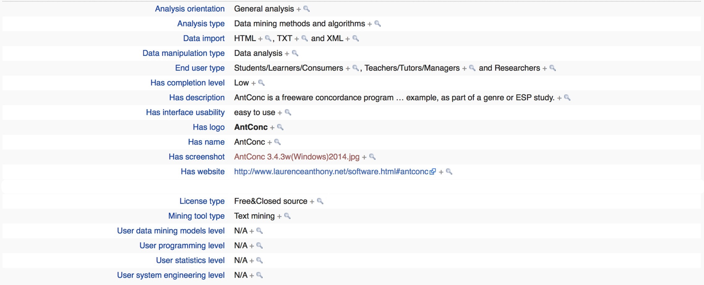

==================
FAQ
==================

Facts about "Antconc"
---------------------

About Users
---------------------
Tool is suitable for:
Students/Learners/Consumers   Teachers/Tutors/Managers 	Researchers 
Tool is unsuitable for:
Developers/Designers 	Organisations/Institutions/Firms 	Others 

Performance Issues
---------------------
The performance of searches can be very slow when the case option is deactivated (the default). Much higher performance can be gained by activating this option. (The performance drop here is related to the handling of Unicode characters). One further way to improve performance (when doing multi-word searches only) is to deactivate the "Treat search whitespace as one or more non-tokens" in the Wildcard global settings. (Again, the performance drop here is related to the handling of Unicode characters).

About Shortcuts
---------------------
Here is a list of Shortcuts that apply to all tools using window panes for results.
CTRL-C (COMMAND-C on Macintosh OS X) = Copies the currently selected text
CTRL-A (COMMAND-A on Macintosh OS X) = Selects all text in the window pane
ALT-A (OPTION-A or COMMAND+OPTION-A on Macintosh OS X) = Selects all text in all window panes showing
Double click = Selects the current word
Triple click = Selects the current line in the window pane
SHIFT-click = Selects continuous lines across all window panes showing CTRL-click = Selects discontinuous lines across all window panes showing
DELETE (BACKSPACE on Macintosh OS X) = This deletes any selected lines that span across all window panes INSERT (SHIFT + BACKSPACE on Macintosh OS X) = This keeps any selected lines that span across all window panes, and deletes all others
For any 'spinbox' widgets (e.g. the search term entry box) the 'UP' and 'DOWN' arrow keys on the keyboard can be used to activate the up and down buttons.

Saving Results
---------------------
Results can be saved to the clipboard, saved to a text file (.txt), saved to a postscript file (.ps) -for the Concordance Plot tool, or saved to a new window using keyboard commands, the appropriate option in the 'File Menu', or by clicking on the "Save Window" button in each tool, respectively. Also, it is possible to launch multiple clones of AntConc by double clicking on the .exe file.

Comments/Suggestions/Bug Fixes
-----------------------------------
All new editions and bug fixes are listed in the revision history below. However, if you find a bug in the program, or has any suggestions for improving the program, please let me know and I will try to address the issues in a future version. Indeed, the revisions that have been made are largely due to the comments of users around the world, for which I am very grateful.

