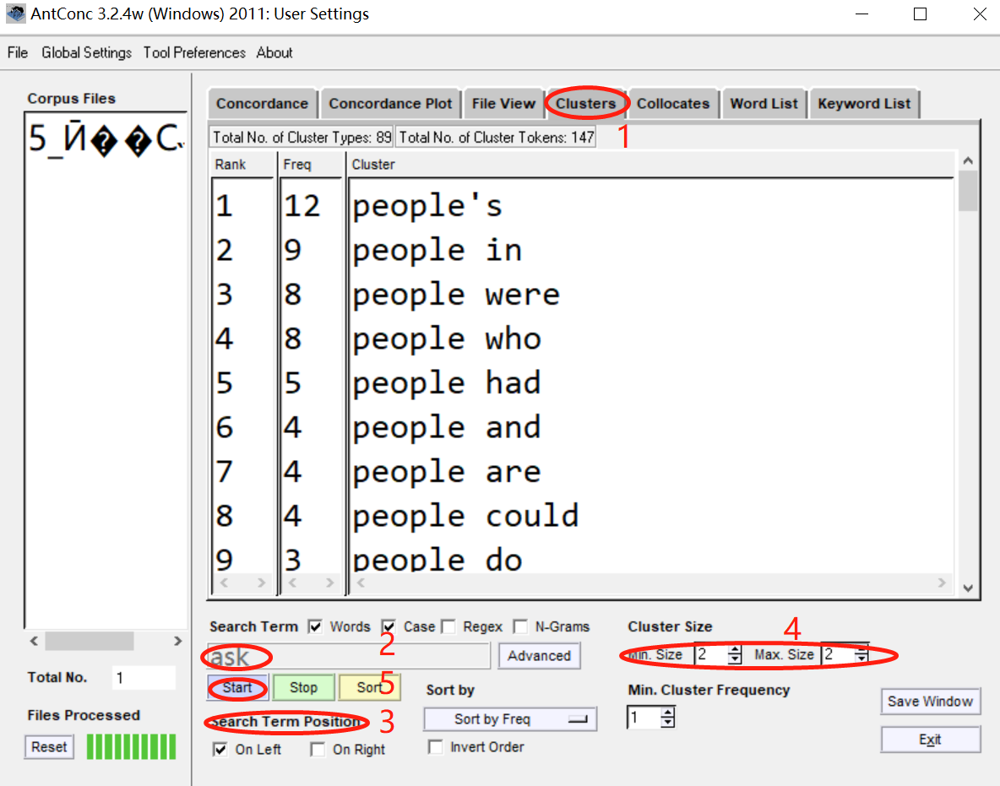

==================
Clusters
==================

This allows you to search for a word or pattern and group (cluster) the results together with the words immediately to the left or right of the search term.The clusters can be ordered by frequency, the start or end of the word, the range of the cluster (number of files in which the cluster appears), or the probability of the first word in the cluster preceding the remaining words.

The following steps produce a set of clusters from a corpus and demonstrate the main features of this tool.

1. Click on 'Clusters'.
2. Enter a search term, like'ask'.
3. Select a 'Search Term Position'.
4. Select a 'Cluster Size'.
5. Click on 'Start' for a search.

In addition to the above, the following settings can be made:

- Use the “Treat all data as lowercase” option (default) causes all words to be transformed to lowercase words. This is useful to get accurate counts of words in certain cases.

- Use the “Treat case in sort” option causes capitalized words to appear before lower-case words.

