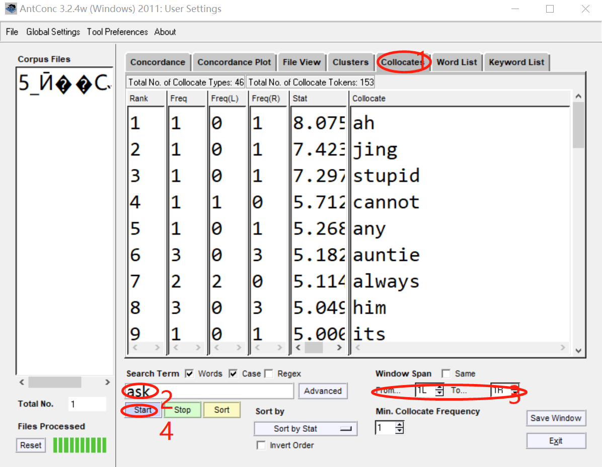

==================
Collocates
==================

This tool allows you to search for collocates of a search term.The collocates can be ordered either by total frequency, frequency on the left or right of the search term, or the start or end of the word. They can also be ordered by the value of a statistical measure between the search term and the collocate.

The following steps produce a set of collocates from a corpus and demonstrate the main features of this tool.

1. Click on 'Collocates'.
2. Enter a search term, like'ask'.
3. Select a span for the collocation.
4. Click on 'Start' for a search.

In addition to the above, the following settings can be made:

- Use the "Selected Collocate Measure" to choose the statistical measure for measuring collocate strength. Currently, two statistical measures can be used: Mutual Information (MI) and T-Score. See the tool explanation above for references to the statistics.

- Use the “Treat all data as lowercase” option causes all words to be transformed to lower-case words. This is useful to get accurate counts of words in certain cases.

- Use the “Treat case in sort” option causes capitalized words to appear before lower-case words.

