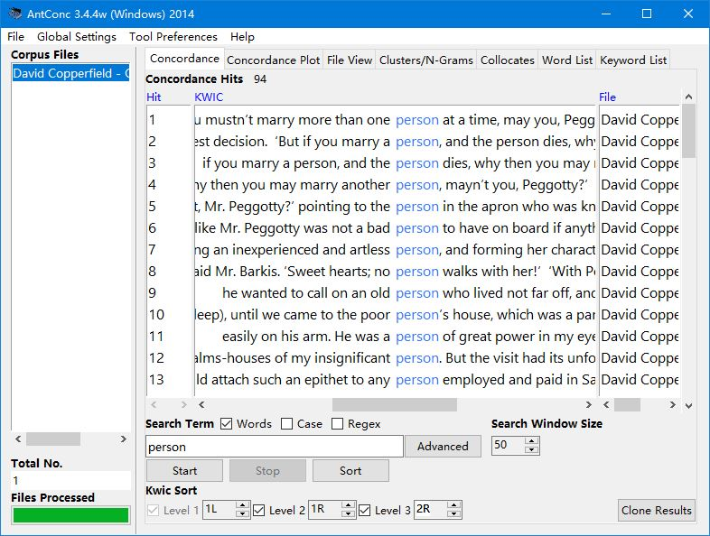
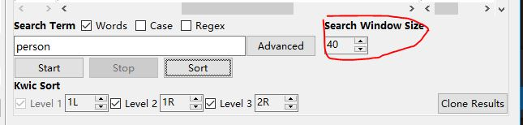
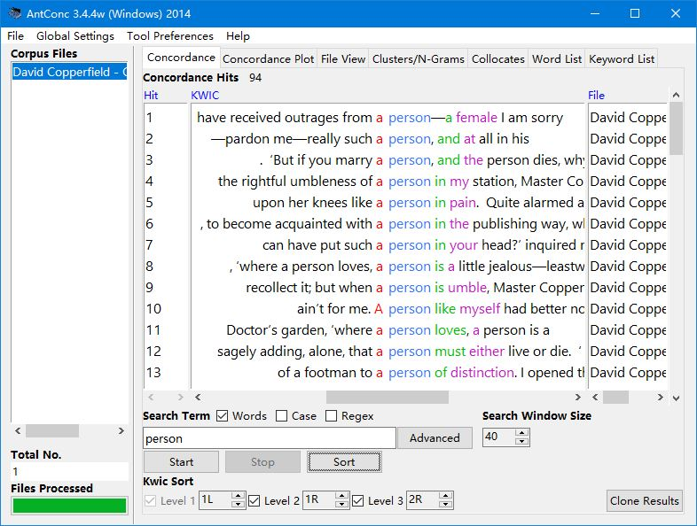
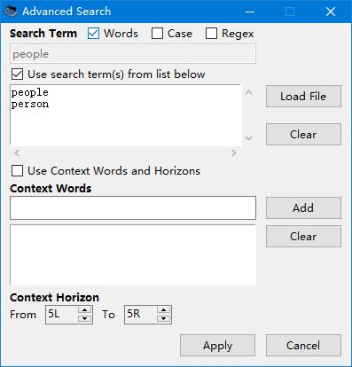
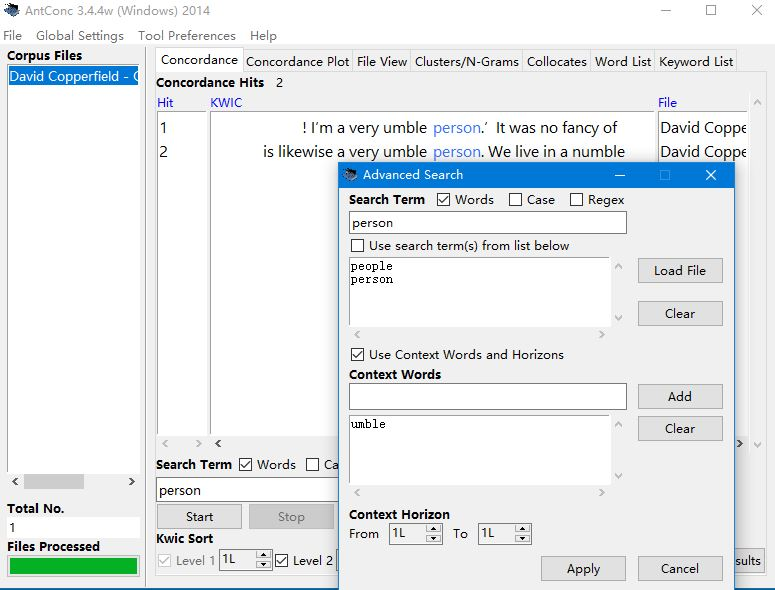

==================
Concordance
==================

This tool shows search results in a 'KWIC' (KeyWord In Context) format. This allows you to see how words and phrases are commonly used in a corpus of texts.

The following steps produce a set of concordance lines from a corpus and demonstrate the main features of this tool.

1. Select one or more files for processing from using the 'Open File(s)...' or 'Open Dir...' options in the 'File' menu. The list of selected files is shown in the left frame of the main window.
2. Enter a search term on which to build concordance lines in the search box.
3. Click on the 'Start' button to start the concordance lines results generation. The concordance generation can be halted at any time by clicking on the 'Stop' button.

There are additional actions available.

- You can choose the number of text characters to be outputted on either side of the search term, using the increase and decrease buttons on the right of the button bar under the "Search Window Size" title. (default value is 50 characters)

- Use the Kwic Sort options to rearrange the concordance lines at three different levels. 0 is the search word, 1L, 2L... are words to the left of the target word, 1R, 2R... are words to the right of the target word.

- Move the cursor over the highlighted search term in one of the concordance lines. The cursor will change to a small hand icon. Clicking on the highlighted search term, will allow you to view the search term hit as it appears in the original file via the File View Tool (see below).

- You can use the "words" checkbox above the search term inputbox to search words or characters, the "case" checkbox to search in case insensitive or sensitive mode and the "regex" checkbox to use regular expressions. AntConc supports Perl regular expressions. You can find more infomation here: `Regular Expressions Quick Start <http://www.regular-expressions.info/quickstart.html>`_

.. image:: images/concordance_checkbox.JPG

- Click on the “Clone Results” button to create a copy of the results so that different sets of results can be compared.

Advanced Options
---------------------

Click the "Advanced" to use advanced options.

- You can search multiple words by typing or by loading in a list of search terms from a file.

- The second advanced search option allows you to define context words and a context window within which the search term(s) must appear.

For example, to search for "person" where the word "umble" is the ajacent word in the left, set the search term as "person," the context word as "umble," and set the context window as 'From' 1L 'To' 1L.

