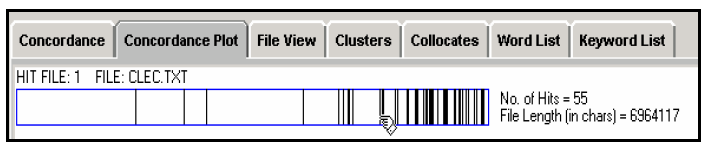

==================
Concordance Plot
==================

This tool shows concordance search results plotted in a 'barcode' format, with the length of the text normalized to the width of the bar and each hit shown as a vertical line within the bar. 
This allows you to see the position where search results appear in target texts. 

