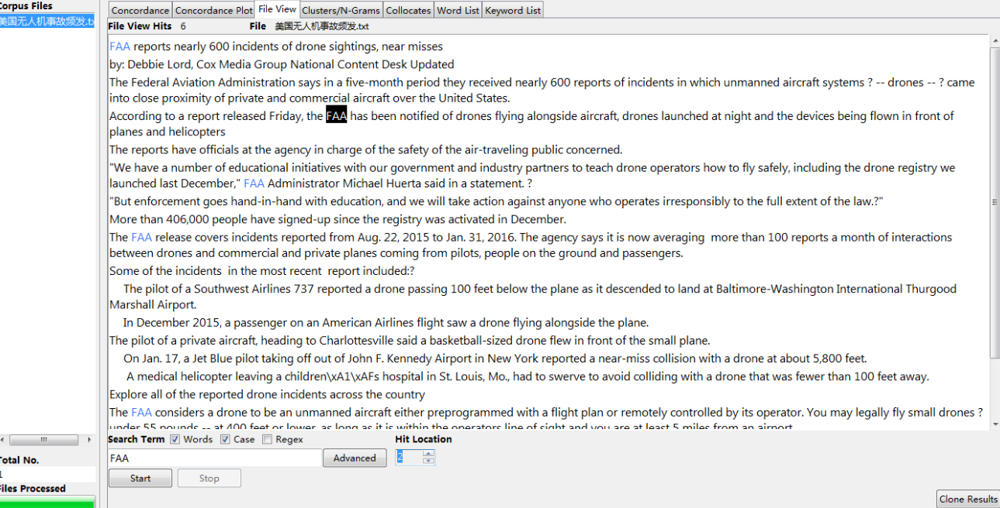
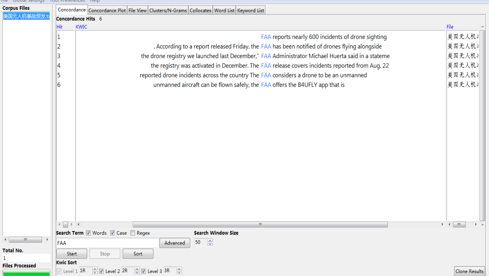

===========
File View
===========

This tool shows the raw text of individual files. This allows you to investigate in more detail the results generated in other tools of
AntConc.

For example, if you search "FAA", it will be highlighted throughout the text. And you can see the context of“FAA". Search options are the same as for the Concordance Tool and Concordance Plot Tool.

If you click on the searched term "FAA", you will get a set of KWIC lines.

