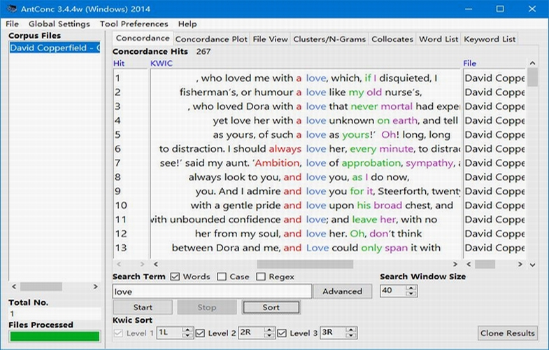

Introduction
=============

AntConc is a freeware corpus analysis toolkit for concordancing and text analysis. 

It runs on any computer running Microsoft Windows (tested on Win 98/Me/2000/NT, XP, Vista, Win 7), Macintosh OS X (tested on 10.4.x, 10.5.x, 10.6.x), and Linux (tested on Ubuntu 10, Linux Mint). It is developed in Perl using various compilers to generate executables for the different operating systems.

