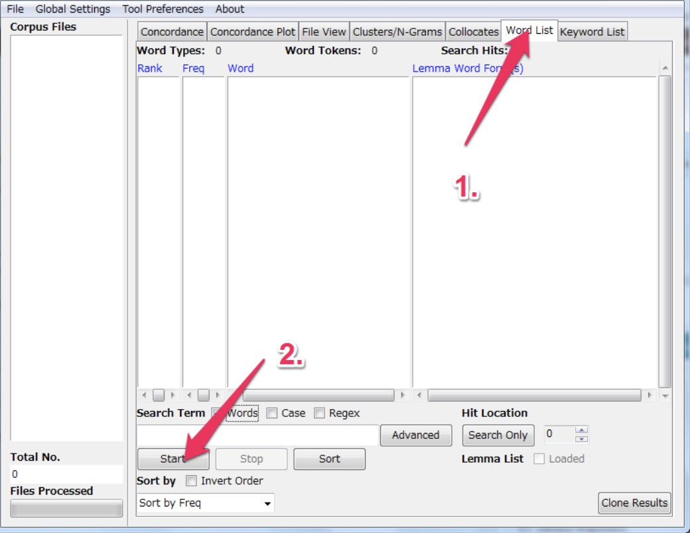
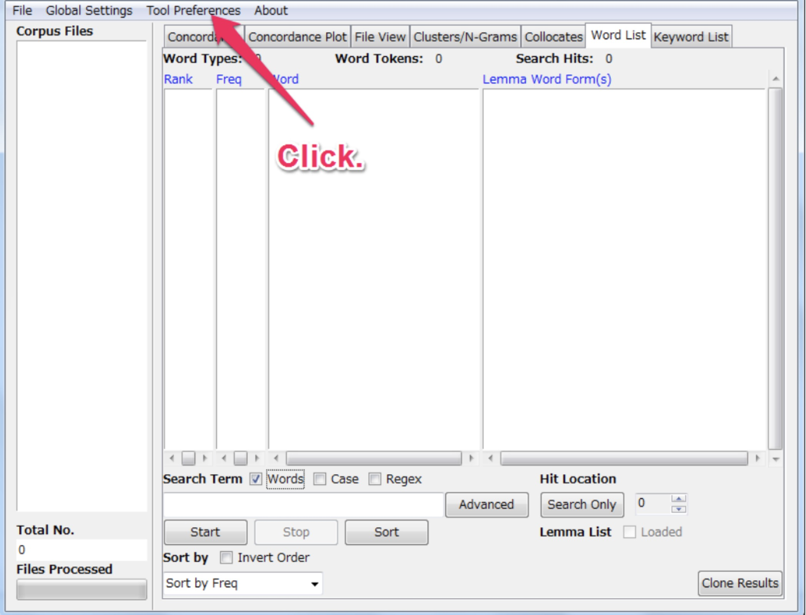
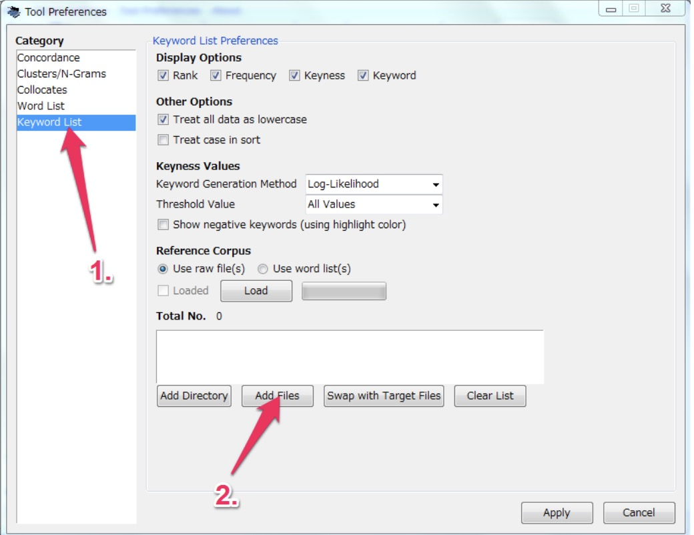
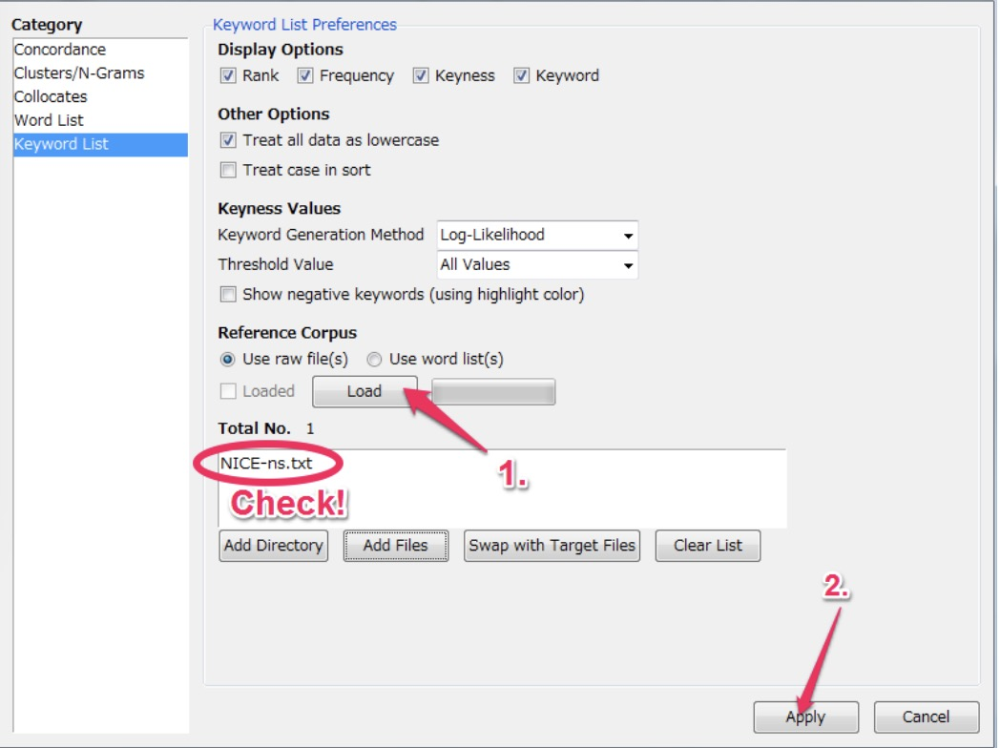
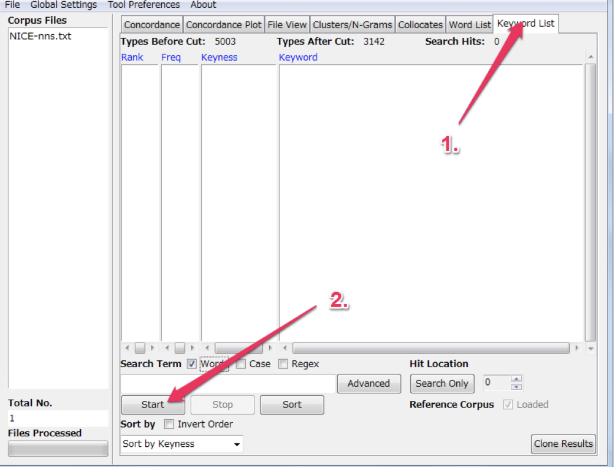
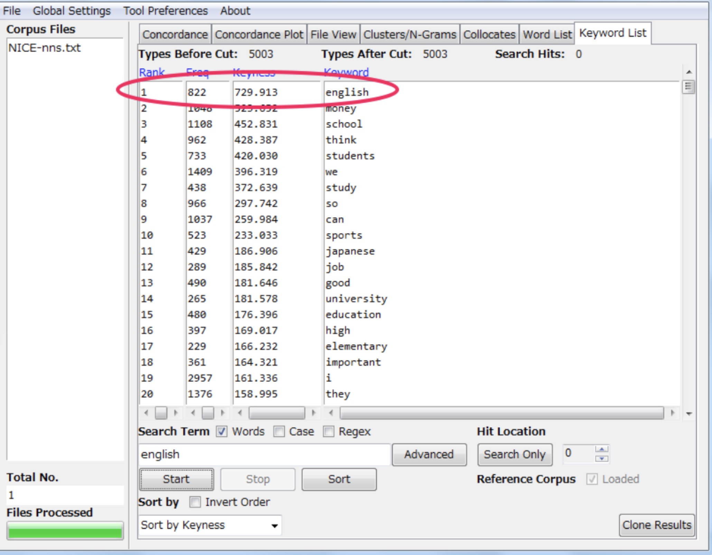

==================
Keyword List
==================
This tool shows the which words are unusually frequent (or infrequent) in the corpus in comparison with the words in a reference corpus. This allows you to identify characteristic words in the corpus, for example, as part of a genre or ESP study. The following steps produce a keyword list and demonstrate the main features of this tool.

1. In AntConc load your corpus or corpora. Go to Wordlist tab then click start.

2. Select the Tools Preference menu.

3. Click the ‘Keywords List’ option, then click ‘Add Files’.

4. Check the desired file is there. Click ‘Load’ then click ‘Apply’.

5. Go to ‘Keyword List’ tab then click ‘Start’.

6. A list of types should appear like this.

The keywords are ranked by default by the keyness. In this example the top ranking type in “english” with a score keyness (in this example, chi-squared) of 729.913 (this is a combined score of both the target and reference type score). And it has a frequency of 822 in the target list.

Keyword List Preferences
---------------------------
In addition to the above the following settings can be made:

1. Using the “Treat all data as lowercase” option causes all words to be transformed to lower-case words. This is useful to get accurate counts of words in certain cases.
2. Using the “Treat case in sort” option causes capitalized words to appear before lower-case words.
3. Use the "Show Negative Keywords" option to view words that are unusually INFREQUENT in the target corpus compared with the reference corpus.
4. Use the "Keyness Values" options to choose the statistical measure for measuring keyword strength, the statistical threshold used to decide a cutoff point, the effect size measure used to rank the keywords, and the effect size threshold to decide the cutoff of the effect size. Currently, two statistical measures can be used: Chi-Squared and Log-Likelihood (the default). The default option for the 'keyness' measure is recommended, however, you may want to experiment with different effect size measure depending on the corpus you are using. The selection of statistical measures and effect size measures are inspired by the work of Andrew Hardie of Lancaster University.
5. Use the "Use raw file(s)" option to use raw reference corpus file(s) as the reference corpus.
6. Use the "Use word list(s)" option to use word list(s) that correspond to a reference corpus. The word list(s) should be formatted as described in the tool explanation.
7. Click the "Add Directory" or "Add Files" buttons to select the reference corpus files.
8. Click the "Swap with Target Files" button to swap the main and reference corpora. Note that this will only make sense when raw corpus files are being used. 

