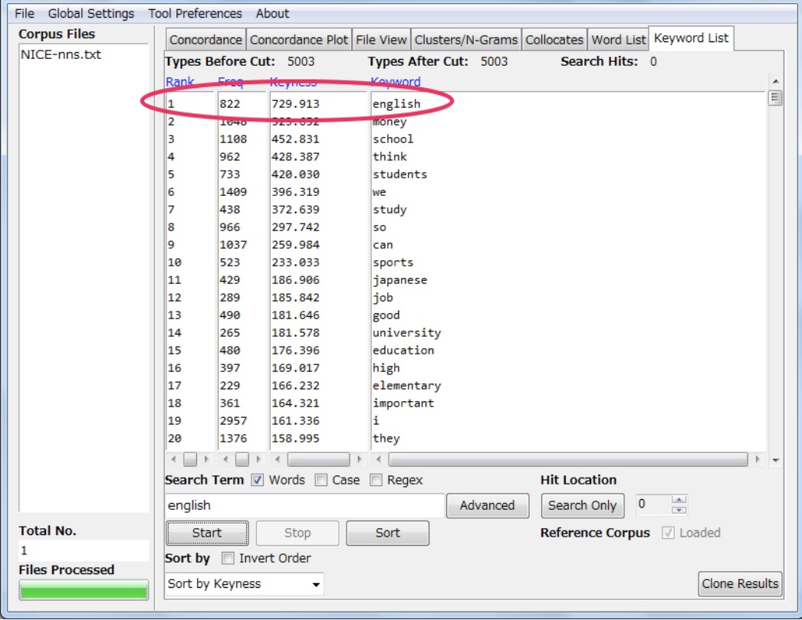

==================
Keyword List
==================
This tool shows the which words are unusually frequent (or infrequent) in the corpus in comparison with the words in a reference corpus. This allows you to identify characteristic words in the corpus, for example, as part of a genre or ESP study. The following steps produce a keyword list and demonstrate the main features of this tool.

1. Select a set of target files.
2. Go to the 'Preferences' menu and chose the 'Keyword Preferences' option.
3. Choose the keyword generation method (a statistical measure) to calculate the 'keyness' of the target file words. The default setting of Log Likelihood is recommended.
4. Choose a significance value (p value) for keyness statistic.
5. Choose an effect size measure to rank the keywords.
6. Choose a threshold for the number of keywords to be displayed.
7. Choose whether or not to view 'Negative Keywords' (target file words with an unusually low frequency compared with the frequency in the reference corpus)
8. Choose one of the reference corpus options. Select "Use raw file(s)" when you will use raw text (.txt) files to serve as the reference corpus. Select "Use word list(s)" when you will use one of more word lists that are generated from a reference corpus. The "Use word list(s)" option allows you to generate keywords even when the original reference corpus is not available. The format for a word list is as follows with the values in the rows separated by tabs: RANK FREQUENCY WORD. 1 12838 the 2 11289 a 3 8583 of ... Note that blank lines and lines beginning with # will be ignored. Also, AntConc will check that the file(s) are correctly formatted and report any errors.
9. Load the reference corpus of text (.txt) files, in the same way that the target files are chosen.
10. The reference corpus directory will be shown (if appropriate), and the list of reference corpus files will appear at the bottom of the Keyword Preferences option menu.
11. Click ‘Apply’ in the Keyword Preferences menu and return to the main Keywords window.
12. Choose suitable options for displaying the list of generated Keywords (in a similar manner to the options for generating a Word List).
13. Press the 'Start' button. At any time, the generation of the keyword list can be halted using the 'Stop' button.
14. Click on the keyword to generate a set of KWIC lines using the text as the search term.
15. Click on the “Clone Results” button to create a copy of the results so that different sets of results can be compared.

The keywords are ranked by default by the keyness. In this example the top ranking type in “english” with a score keyness (in this example, chi-squared) of 729.913 (this is a combined score of both the target and reference type score). And it has a frequency of 822 in the target list.

Keyword List Preferences
---------------------------
In addition to the above the following settings can be made:

1. Using the “Treat all data as lowercase” option causes all words to be transformed to lower-case words. This is useful to get accurate counts of words in certain cases.
2. Using the “Treat case in sort” option causes capitalized words to appear before lower-case words.
3. Use the "Show Negative Keywords" option to view words that are unusually INFREQUENT in the target corpus compared with the reference corpus.
4. Use the "Keyness Values" options to choose the statistical measure for measuring keyword strength, the statistical threshold used to decide a cutoff point, the effect size measure used to rank the keywords, and the effect size threshold to decide the cutoff of the effect size. Currently, two statistical measures can be used: Chi-Squared and Log-Likelihood (the default). The default option for the 'keyness' measure is recommended, however, you may want to experiment with different effect size measure depending on the corpus you are using. The selection of statistical measures and effect size measures are inspired by the work of Andrew Hardie of Lancaster University.
5. Use the "Use raw file(s)" option to use raw reference corpus file(s) as the reference corpus.
6. Use the "Use word list(s)" option to use word list(s) that correspond to a reference corpus. The word list(s) should be formatted as described in the tool explanation.
7. Click the "Add Directory" or "Add Files" buttons to select the reference corpus files.
8. Click the "Swap with Target Files" button to swap the main and reference corpora. Note that this will only make sense when raw corpus files are being used. 

