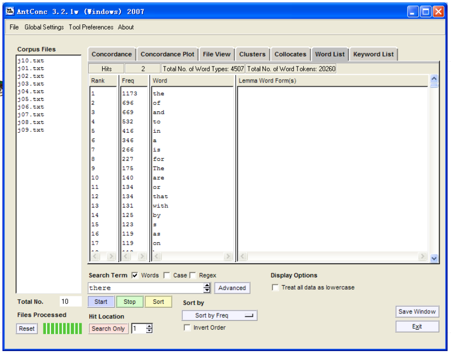

==================
Word List
==================
This tool counts all the words in the corpus and presents them in an ordered list. This allows you to quickly find which words are the most frequent in a corpus. 

The words can be ordered either by frequency or the start or end of the word, and the ordering can be inverted. The word list can also be generated in case-insensitive mode, where words in upper and lower case are treated the same (default) or case-sensitive, where words in upper and lower case are treated separately. 

The following steps produce a word list and demonstrate the main features of this tool. 

1. Choose the appropriate ordering options. 

2. Press the 'Start' button. At any time, the generation of the word list can be halted using the 'Stop' button. 

3. Click on the word to generate a set of KWIC lines using the text as the search term. 

4. Click on the “Clone Results” button to create a copy of the results so that different sets of results can be compared. 
 
A number of menu preferences are available with this tool. (See below). 

Word List Preferences
------------------------

In addition to the above the following settings can be made: 

1. Using the “Treat all data as lowercase” option causes all words to be transformed to lower-case words. This is useful to get accurate counts of words in certain cases. 
2. Using the “Treat case in sort” option causes capitalized words to appear before lower-case words.  
3. Use the lemma list options to select a lemma list. A 'lemma list' can be loaded from a file, which can then be used to generate a lemma list instead of a word list. When the lemma list function is used, the 'lemma word form(s)' column will show the words in the corpus associated with each lemma. A lemma list can be created by specifying the 'lemma entry' follow by '->' followed by one or more 'words' that should be assigned to the lemma separated by commas or tabs (with or without additional space around the words). See the example below: 
	 	
         ======================================================        ======================================================
            ’’be->is, are 	 	 	                                	be->is<tab>are’’ 
	 	    ’’play -> play, plays, playing, played 	                    play->play <tab> plays <tab> playing <tab> played’’ 
         ======================================================        ======================================================
4. Using the "Use word list" option under the "Target Corpus" heading, a pre-built word list contained in a single file can be loaded after selecting the file by clicking on "Load Word List".  
5. Using the "Word List Range" option, a wordlist can be generated using all words (“Use all words”), or a specific set of words (“Use specific words below”), or ignoring a certain set of words (“Use a stoplist below”). The range of words to be used (or ignored) can be entered directly, or can be stored in files which are then read by AntConc by pressing the 'Open' button. A combination of words in a file and words directly entered can also be used. 
